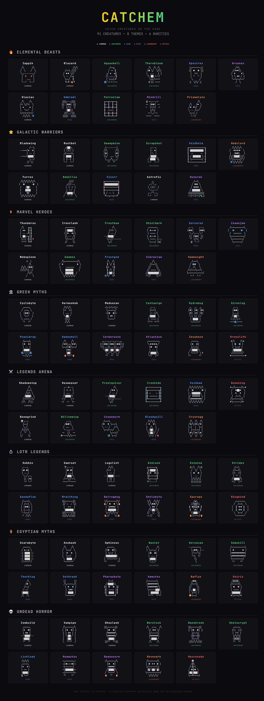

<div align="center">

# CatchEm

**Catch creatures as you code. No interaction needed.**

A passive creature collection game that runs in the background while you use your favorite AI coding assistant. Creatures appear automatically — just keep coding.

[](https://opensource.org/licenses/MIT)
[](https://nodejs.org)
[](https://www.npmjs.com/package/catchem)

<!-- Replace with actual video URL after uploading to GitHub -->
<!-- To add the video: drag catchem-showcase.mp4 into a GitHub issue/PR comment, copy the URL, paste here -->

</div>

---

## How It Works

1. **Install** — `npm install -g catchem`
2. **Setup** — `catchem setup` detects your platform and installs hooks
3. **Code** — creatures appear passively as you work
4. **Collect** — browse your collection with an interactive terminal UI

That's it. No prompts, no menus, no energy systems. Just code and catch.

## Passive Catching

At the end of each coding session, there's a chance a creature appears. The **pity timer** ensures you're never unlucky for too long:

- **First ever catch** — guaranteed (100%)
- **After each catch** — rate resets to 20%
- **Each miss** — rate increases by 5% until you catch something

Catches appear inline with ASCII art and a flavor comment from the creature:

```
✨ You caught a Blazard! (x3)
[Lv.2] ████░░░░░░ 5/7
         ╱╲╱╲
   ╱══╲ ╱╱╱╱
  ╱ ◆◆ ╲╱╱
  ╲ ── ╱═╗
   ╲══╱  ║
    ╚═╝~🔥╝
"A TOWN?! Finally, somewhere to overheat besides your CPU fan."
```

## Creatures

**91 creatures** across 8 themed collections, each with unique ASCII art and coding-themed personalities.

<div align="center">

</div>

| Theme | Inspiration | Examples |
|-------|------------|----------|
| **Elemental Beasts** | Pokemon | Zappik, Blazard, Aquashell, Spectrex, Prismalynx |
| **Galactic Warriors** | Star Wars | Voidhelm, Nebulord, Furrox, Rebellia, Vizorr |
| **Marvel Heroes** | Marvel | Thunderox, Ironclash, Cosmojaw, Webspinne, Hawksight |
| **Greek Myths** | Greek Mythology | Hydrabug, Zeushock, Kronolith, Meduscan, Cerberoute |
| **Legends Arena** | League of Legends | Runeking, Voidmaw, Cosmowyrm, Crystogg |
| **LOTR Legends** | Lord of the Rings | Gandaflow, Balrogbug, Ringbind, Saurops |
| **Egyptian Myths** | Egyptian Mythology | Osirix, Scarabyte, Anubash, Pharaobyte |
| **Undead Horror** | Horror | Necronode, Lichload, Zombuild, Revenark |

All creatures are original characters with unique ASCII art and coding-themed descriptions.

### Rarity System

| Tier | Chance | Color |
|------|--------|-------|
| Common | 50% | ⬜ White |
| Uncommon | 25% | 🟩 Green |
| Rare | 12% | 🟦 Blue |
| Epic | 7% | 🟪 Purple |
| Legendary | 4% | 🟧 Orange |
| Mythic | 2% | 🟥 Red |

### Leveling

Catch duplicates to level up your creatures. 13 levels with escalating thresholds — from 1 catch for Level 1 to 9,587 for max level.

## Collection Viewer

Browse your collection in an interactive terminal UI with:

- Scrollable 3-column grid with windowed viewport
- Animated ASCII art (idle blinking, breathing, energy pulses)
- Rarity-colored borders and creature names
- Undiscovered creatures shown as masked silhouettes
- Detail view with full stats on Enter
- Level progress bars
- Discovery counter

Run it with:

```bash
catchem collection
```

Or use the `/catchem-collection` skill in Claude Code.

## Installation

```bash
npm install -g catchem
```

Setup runs automatically after install. To manually set up or reconfigure:

```bash
catchem setup
```

### Supported Platforms

| Platform | Hook Event | Status |
|----------|-----------|--------|
| Claude Code | Stop | Supported |
| Cursor | stop | Supported |
| GitHub Copilot | sessionEnd | Supported (per-project) |
| Codex CLI | Stop | Supported |
| OpenCode | session.end | Supported |
| Gemini CLI | AfterAgent | Supported |

## Commands

| Command | What it does |
|---------|-------------|
| `catchem setup` | Detect platforms, install hooks and skills |
| `catchem setup --auto` | Silent setup (used by postinstall) |
| `catchem collection` | Open interactive TUI collection viewer |
| `catchem help` | Show help message |

## Game Data

Your game state is saved at `~/.catchem/state.json`. This includes:

- Caught creatures and their levels
- Total catch count
- Pity timer state
- Session stats

## Auto-Updates

During setup, you can opt in to daily auto-updates. When enabled, a background check runs once per day and updates CatchEm silently via `npm update -g catchem`.

## Contributing

Found a bug? Have an idea for a new creature or theme? [Open an issue](https://github.com/amit221/catchem/issues).

---

<div align="center">

**Start catching creatures today.**

[Install](https://www.npmjs.com/package/catchem) | [Issues](https://github.com/amit221/catchem/issues) | [Changelog](https://github.com/amit221/catchem/blob/master/CHANGELOG.md)

<sub>CatchEm — a passive creature collection game for AI-assisted coding</sub>

</div>
